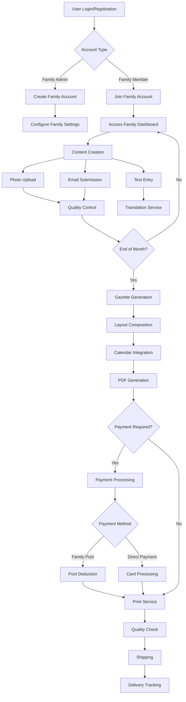
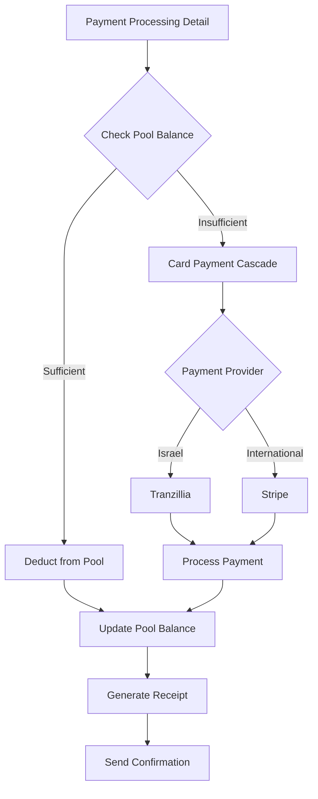
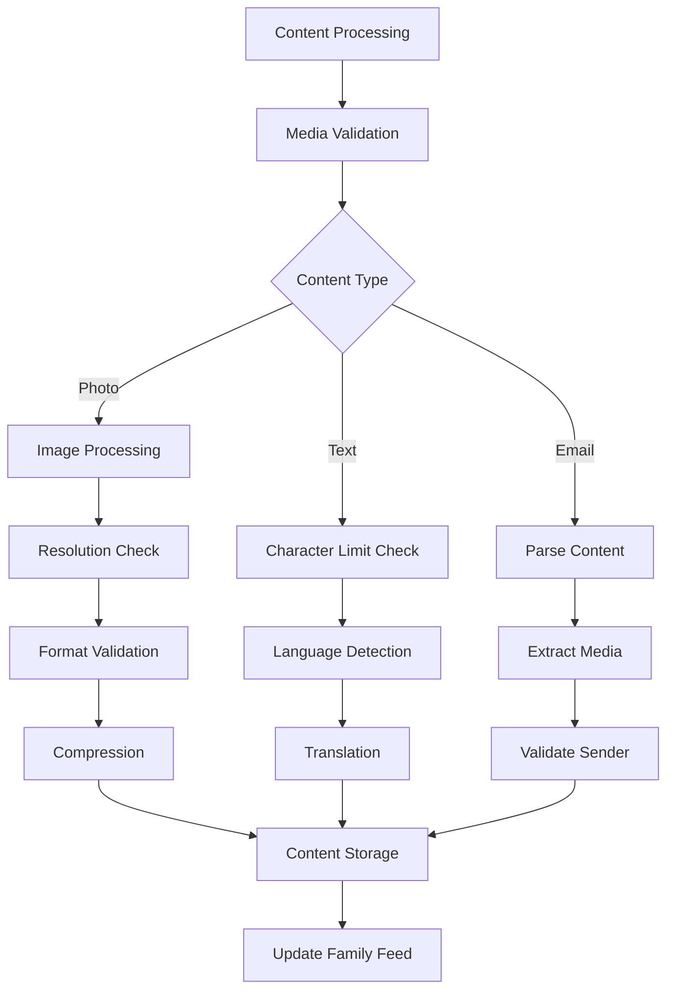
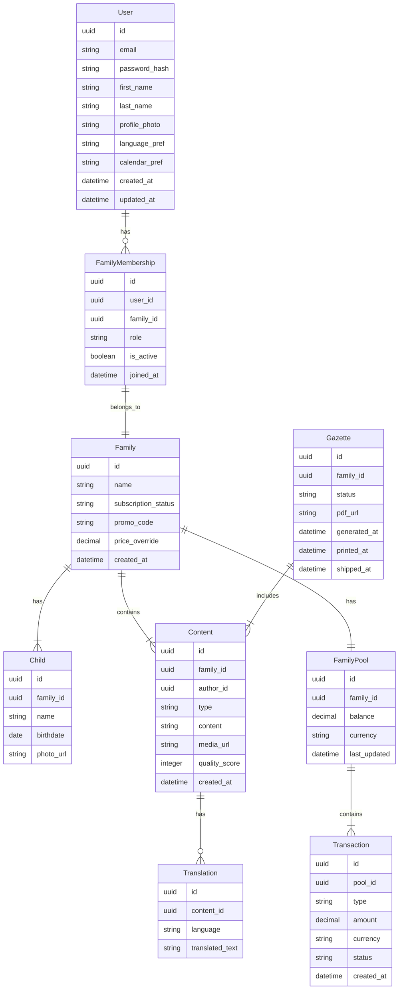
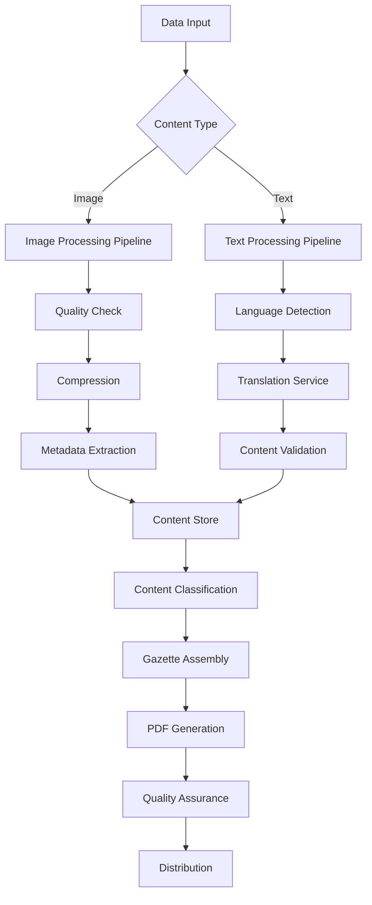
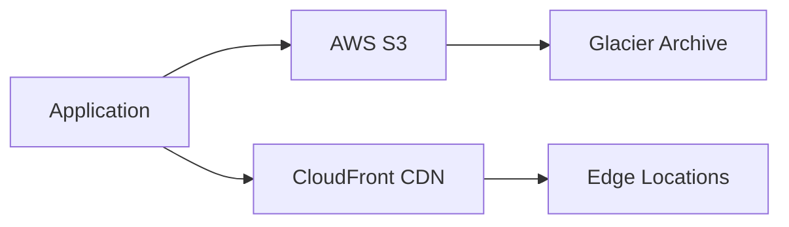
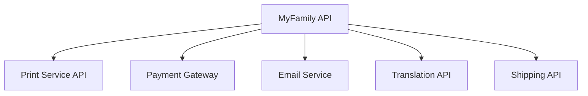

# Product Requirements Document (PRD)

# 1. INTRODUCTION

## 1.1 Purpose
This Software Requirements Specification (SRS) document provides a comprehensive description of the MyFamily intergenerational connection platform. It is intended for:
- Development team members
- Project stakeholders
- Quality assurance teams
- System architects
- External integration partners
- Maintenance personnel

The document serves as the authoritative source for technical, functional, and business requirements throughout the development lifecycle.

## 1.2 Scope
MyFamily is a digital-to-print platform that bridges generational gaps through personalized family gazettes. The system encompasses:

- Web and mobile applications for content creation and family management
- Automated gazette generation and printing pipeline
- Multi-currency payment processing system
- International shipping integration
- Multilingual support across 8 languages
- Multi-calendar system support
- Family pool funding mechanism

Key Benefits:
- Simplified family connection for tech-averse seniors
- Physical, tangible family memories
- Collaborative family engagement
- Automated content curation and publishing
- Secure, private family sharing
- Flexible payment options

Core Functionalities:
- User and family account management
- Content upload and curation
- Automated gazette layout and generation
- Payment processing and family pool management
- Multi-language content translation
- International printing and distribution
- Calendar system integration
- Promotional code system

# 2. PRODUCT DESCRIPTION

## 2.1 Product Perspective
MyFamily operates as a hybrid digital-physical platform within the family communication ecosystem. The system integrates with:

- Cloud storage services for media management
- International printing and distribution networks
- Payment processing systems (Stripe and Tranzillia)
- Postal tracking systems
- Translation services
- Multiple calendar systems
- Email delivery services

The platform functions independently but interfaces with these external systems to deliver its core service.

## 2.2 Product Functions
- Family Account Management
  - Multi-family membership support
  - Role-based access control
  - Member invitation and verification
  - Profile and preferences management

- Content Management
  - Photo upload and quality control
  - Text content creation and translation
  - Email-based content submission
  - Automated content curation

- Gazette Generation
  - Automated layout composition
  - Multi-calendar event integration
  - Birthday and anniversary tracking
  - Quality assurance checks
  - PDF generation and print preparation

- Financial Management
  - Family pool funding system
  - Multi-currency support
  - Promotional code processing
  - Automated payment cascade
  - Transaction history tracking

## 2.3 User Characteristics

| User Type | Characteristics | Technical Proficiency | Primary Usage |
|-----------|----------------|----------------------|---------------|
| Primary Contributors | Adults 25-50, busy professionals, parents | Moderate to High | Content creation, payment management |
| Secondary Contributors | Young adults 18-25, tech-savvy | High | Content sharing, social features |
| Family Administrators | Adults 30-60, family organizers | Moderate | Account management, invitation control |
| Recipients | Seniors 65+, tech-averse | Low | Physical gazette consumption |
| System Administrators | Technical staff | Expert | Platform maintenance, support |

## 2.4 Constraints
- Technical Constraints
  - Minimum image resolution requirements (300 DPI for print)
  - Maximum 28 photos per gazette
  - 500-character limit per text entry
  - Support for only 8 specified languages
  - Limited to 4 calendar systems

- Business Constraints
  - Fixed pricing structure (70 shekels standard, 50 shekels promotional)
  - Monthly publication cycle
  - Geographic printing partner availability
  - Payment processor coverage limitations

- Regulatory Constraints
  - GDPR compliance requirements
  - CCPA compliance requirements
  - Local data protection laws
  - Financial services regulations

## 2.5 Assumptions and Dependencies
Assumptions:
- Stable internet connectivity for digital platform users
- Reliable postal services in target markets
- Consistent printing partner availability
- Stable currency exchange rates
- User access to supported payment methods

Dependencies:
- Third-party Services:
  - AWS S3 for storage infrastructure
  - Stripe and Tranzillia for payment processing
  - Postal delivery services
  - Professional printing services
  - Translation service providers
  - Email delivery services

- Technical Dependencies:
  - React.js and React Native frameworks
  - Node.js runtime environment
  - PostgreSQL database system
  - Redis caching system
  - JWT authentication system

# 3. PROCESS FLOWCHART

# 4. FUNCTIONAL REQUIREMENTS

## 4.1 User Account Management

### ID: F-UAM-001
### Description
Core user account and profile management functionality including registration, authentication, and profile maintenance.
### Priority: High

| Requirement ID | Requirement Description | Acceptance Criteria |
|----------------|------------------------|-------------------|
| UAM-001 | User registration with email/password or Google OAuth | - Valid email verification - Password strength validation - Google OAuth integration |
| UAM-002 | Two-factor authentication (2FA) | - SMS or email verification - QR code backup options |
| UAM-003 | Profile management | - Profile photo upload - Contact information updates - Language preferences - Calendar system selection |
| UAM-004 | Multi-family account switching | - List of associated families - One-click family context switching - Active family indicator |

## 4.2 Family Management

### ID: F-FM-001
### Description
Family account creation, member management, and invitation system.
### Priority: High

| Requirement ID | Requirement Description | Acceptance Criteria |
|----------------|------------------------|-------------------|
| FM-001 | Family account creation | - Family name and details - Primary administrator assignment - Initial settings configuration |
| FM-002 | Member invitation system | - Unique invitation links - Email invitations - Role assignment - Expiration controls |
| FM-003 | Role-based permissions | - Admin role capabilities - Member role restrictions - Role modification controls |
| FM-004 | Children profile management | - Child information entry - Birthday tracking - Photo management |

## 4.3 Content Management

### ID: F-CM-001
### Description
Upload, organization, and management of family content including photos and text.
### Priority: High

| Requirement ID | Requirement Description | Acceptance Criteria |
|----------------|------------------------|-------------------|
| CM-001 | Photo upload system | - Support for JPEG/PNG formats - 300 DPI minimum resolution - Automatic quality validation |
| CM-002 | Text content creation | - 500 character limit enforcement - Multi-language support - Basic formatting options |
| CM-003 | Email content submission | - Dedicated family email address - Automatic content processing - Sender verification |
| CM-004 | Content moderation | - Inappropriate content detection - Manual review options - Content removal capabilities |

## 4.4 Gazette Generation

### ID: F-GG-001
### Description
Automated creation and management of family gazettes.
### Priority: High

| Requirement ID | Requirement Description | Acceptance Criteria |
|----------------|------------------------|-------------------|
| GG-001 | Layout automation | - Template application - Dynamic content placement - Photo-text balance |
| GG-002 | Calendar integration | - Multi-calendar system support - Event synchronization - Birthday/anniversary tracking |
| GG-003 | Quality control | - Image resolution verification - Text formatting check - Layout validation |
| GG-004 | PDF generation | - Print-ready output - Color profile management - Metadata inclusion |

## 4.5 Payment Processing

### ID: F-PP-001
### Description
Payment handling and family pool management system.
### Priority: High

| Requirement ID | Requirement Description | Acceptance Criteria |
|----------------|------------------------|-------------------|
| PP-001 | Family pool management | - Balance tracking - Transaction history - Multi-currency support |
| PP-002 | Payment cascade system | - Pool balance check - Automatic payment provider selection - Failed payment handling |
| PP-003 | Promotional code system | - Code validation - Discount application - Usage tracking |
| PP-004 | Transaction reporting | - Receipt generation - Payment notifications - Monthly statements |

## 4.6 Shipping and Distribution

### ID: F-SD-001
### Description
Management of gazette printing and distribution processes.
### Priority: High

| Requirement ID | Requirement Description | Acceptance Criteria |
|----------------|------------------------|-------------------|
| SD-001 | Print service integration | - Print partner API integration - Quality specifications - Order tracking |
| SD-002 | Shipping management | - Address validation - Carrier selection - International shipping support |
| SD-003 | Delivery tracking | - Tracking number generation - Status updates - Delivery confirmation |
| SD-004 | Return handling | - Return address management - Problem resolution workflow - Reshipment processing |

# 5. NON-FUNCTIONAL REQUIREMENTS

## 5.1 Performance Requirements

| Category | Requirement | Target Metric |
|----------|-------------|---------------|
| Response Time | Web/Mobile API Response | < 500ms for 95% of requests |
| | Page Load Time | < 3 seconds initial load |
| | Image Processing | < 2 seconds per image |
| Throughput | Concurrent Users | 10,000 simultaneous users |
| | File Upload | Support 100 simultaneous uploads |
| | Gazette Generation | Process 5,000 gazettes per hour |
| Resource Usage | Memory Usage | < 512MB per server instance |
| | CPU Utilization | < 70% under normal load |
| | Storage Growth | < 1TB per month |

## 5.2 Safety Requirements

| Requirement | Description | Implementation |
|-------------|-------------|----------------|
| Data Backup | Regular automated backups | Daily incremental, weekly full backups |
| Disaster Recovery | System recovery procedures | RPO: 1 hour, RTO: 4 hours |
| Fault Tolerance | Graceful system degradation | Fallback to read-only mode |
| Error Handling | Comprehensive error management | Structured error logging and monitoring |
| Data Integrity | Prevent data corruption | Checksums and validation |

## 5.3 Security Requirements

| Category | Requirement | Specification |
|----------|-------------|---------------|
| Authentication | Multi-factor Authentication | SMS/Email verification |
| | Session Management | JWT with 24-hour expiry |
| | Password Policy | Min 8 chars, complexity rules |
| Authorization | Role-Based Access Control | Admin, Member, Contributor roles |
| | Resource Permission | Family-level access control |
| Encryption | Data at Rest | AES-256 encryption |
| | Data in Transit | TLS 1.3 |
| | Media Storage | Encrypted S3 buckets |
| Privacy | Data Minimization | Collect only necessary data |
| | User Consent | Explicit opt-in for features |
| | Data Retention | Configurable retention periods |

## 5.4 Quality Requirements

### 5.4.1 Availability
- System uptime: 99.9%
- Planned maintenance: < 4 hours monthly
- Redundant infrastructure across regions
- Automated failover mechanisms

### 5.4.2 Maintainability
- Modular architecture
- Comprehensive documentation
- Automated deployment pipeline
- Monitoring and alerting system
- Code coverage > 80%

### 5.4.3 Usability
- Mobile-first responsive design
- WCAG 2.1 Level AA compliance
- Maximum 3 clicks to core functions
- Intuitive navigation structure
- Multi-language support (8 languages)

### 5.4.4 Scalability
- Horizontal scaling capability
- Auto-scaling based on load
- Microservices architecture
- Database sharding support
- CDN integration for media

### 5.4.5 Reliability
- Mean Time Between Failures (MTBF): > 720 hours
- Mean Time To Recovery (MTTR): < 30 minutes
- Error rate: < 0.1% of transactions
- Data durability: 99.999999999%

## 5.5 Compliance Requirements

| Regulation | Requirement | Implementation |
|------------|-------------|----------------|
| GDPR | Data Protection | Privacy by design |
| | User Rights | Data portability, erasure |
| | Consent Management | Granular consent tracking |
| CCPA | Privacy Rights | California resident rights |
| | Data Disclosure | Transparent data usage |
| PCI DSS | Payment Security | Secure payment processing |
| ISO 27001 | Information Security | Security controls framework |
| Local Laws | Data Residency | Regional data storage |
| | Financial Regulations | Payment processor compliance |
| Accessibility | WCAG 2.1 | Accessibility features |

# 6. DATA REQUIREMENTS

## 6.1 Data Models

## 6.2 Data Storage

### 6.2.1 Primary Storage
- PostgreSQL for relational data
  - User accounts and profiles
  - Family relationships
  - Transaction records
  - Content metadata
  - System configurations

### 6.2.2 Media Storage
- AWS S3 for binary data
  - User profile photos
  - Family content images
  - Generated PDFs
  - Backup archives

### 6.2.3 Cache Layer
- Redis for performance optimization
  - Session data
  - Frequently accessed content
  - Real-time family feeds
  - Payment processing states

### 6.2.4 Data Retention
| Data Type | Retention Period | Storage Location |
|-----------|------------------|------------------|
| User Accounts | Indefinite | PostgreSQL |
| Family Content | 24 months | S3 + PostgreSQL |
| Transaction Records | 7 years | PostgreSQL |
| Generated Gazettes | 12 months | S3 |
| System Logs | 90 days | CloudWatch |
| Session Data | 24 hours | Redis |

### 6.2.5 Backup Strategy
- Database Backups
  - Full daily backups
  - Point-in-time recovery (PITR)
  - Cross-region replication
  - 30-day retention

- Media Backups
  - S3 versioning enabled
  - Cross-region replication
  - Lifecycle policies for archival

## 6.3 Data Processing

### 6.3.1 Data Security

| Security Layer | Implementation | Purpose |
|----------------|----------------|----------|
| Encryption at Rest | AES-256 | Protect stored data |
| Encryption in Transit | TLS 1.3 | Secure data transmission |
| Access Control | RBAC + JWT | Authorization management |
| Data Masking | Dynamic masking | PII protection |
| Audit Logging | Comprehensive trails | Security monitoring |

### 6.3.2 Data Processing Rules
- Image Processing
  - Minimum resolution: 300 DPI
  - Maximum file size: 10MB
  - Supported formats: JPEG, PNG
  - Automatic compression for web

- Text Processing
  - Character limit: 500
  - Supported languages: 8
  - Automatic translation
  - Profanity filtering

- Gazette Generation
  - Monthly processing cycle
  - 15-28 photos per issue
  - Automatic layout optimization
  - Quality validation checks

# 7. EXTERNAL INTERFACES

## 7.1 User Interfaces

### 7.1.1 Web Application Interface
- Responsive design supporting desktop (1920x1080) to mobile (320x568)
- Material Design 3.0 components and styling
- Accessibility compliance with WCAG 2.1 Level AA
- RTL support for Hebrew and Arabic interfaces
- Minimum touch target size of 44x44px for mobile
- Maximum 3-click depth navigation structure

### 7.1.2 Mobile Application Interface
- Native iOS (iOS 13+) and Android (API 26+) implementations
- Bottom navigation with 4 primary sections
- Pull-to-refresh content updates
- Offline content viewing capability
- Native sharing integration
- Biometric authentication support

### 7.1.3 Email Interface
- HTML email templates with plain text fallback
- Responsive email design (600px max width)
- Custom email domain for family submissions
- Standardized subject line format
- Support for inline image attachments

## 7.2 Hardware Interfaces

### 7.2.1 Printing Systems
| Interface | Specification | Protocol |
|-----------|--------------|-----------|
| Print Resolution | 300 DPI minimum | Direct PDF submission |
| Color Profile | CMYK color space | ICC profile integration |
| Paper Size | A4 (210 × 297mm) | Standard ISO format |
| Binding | Perfect binding | Automated binding system |

### 7.2.2 Scanner Integration
- TWAIN protocol support for photo imports
- Minimum 300 DPI scan resolution
- Auto-crop and orientation detection
- Direct upload to family account

## 7.3 Software Interfaces

### 7.3.1 Storage Services

| Service | Purpose | Protocol |
|---------|----------|----------|
| AWS S3 | Media storage | REST API/HTTPS |
| CloudFront | Content delivery | HTTPS/HTTP2 |
| Glacier | Long-term archival | S3 API |

### 7.3.2 Payment Services
- Stripe API v2022-11-15
  - Payment intent workflow
  - 3D Secure 2.0 support
  - Webhook integration
- Tranzillia API
  - Direct charge interface
  - Token-based authentication
  - Israeli credit card processing

### 7.3.3 Translation Services
- Google Cloud Translation API
  - Neural machine translation
  - 8 supported languages
  - Batch translation support
- Custom translation memory system
  - Family-specific translations
  - Phrase dictionary
  - Context preservation

## 7.4 Communication Interfaces

### 7.4.1 Network Protocols
| Protocol | Usage | Specification |
|----------|--------|---------------|
| HTTPS | API Communication | TLS 1.3 |
| WebSocket | Real-time Updates | WSS Protocol |
| SMTP | Email Delivery | RFC 5321 |
| HTTP/2 | CDN Delivery | RFC 7540 |

### 7.4.2 API Specifications
- RESTful API
  - JSON payload format
  - JWT authentication
  - Rate limiting: 1000 requests/hour
  - Compression: gzip
  - Cache-Control headers

### 7.4.3 Integration Endpoints

### 7.4.4 Data Exchange Formats
| Format | Usage | Validation |
|--------|--------|------------|
| JSON | API Responses | JSON Schema |
| PDF/X-1a | Print Output | PDF/X compliance |
| JPEG/PNG | Image Assets | Image validation |
| UTF-8 | Text Encoding | Character validation |

# 8. APPENDICES

## 8.1 Glossary

| Term | Definition |
|------|------------|
| Gazette | A monthly printed family newsletter containing curated photos and updates |
| Family Pool | A shared financial account for family members to contribute towards gazette costs |
| Payment Cascade | Automated payment flow that checks pool balance before charging payment methods |
| Primary Contributor | Family member responsible for most content creation and management |
| Recipient | Usually elderly family members who receive the printed gazette |
| Family Administrator | Member with elevated permissions to manage family account settings |
| Content Curator | System component that automatically organizes and layouts content |
| Print Partner | Third-party service provider handling physical gazette printing |

## 8.2 Acronyms

| Acronym | Definition |
|---------|------------|
| API | Application Programming Interface |
| AWS | Amazon Web Services |
| CCPA | California Consumer Privacy Act |
| CDN | Content Delivery Network |
| DPI | Dots Per Inch |
| GDPR | General Data Protection Regulation |
| JWT | JSON Web Token |
| MTBF | Mean Time Between Failures |
| MTTR | Mean Time To Recovery |
| PITR | Point-in-Time Recovery |
| PWA | Progressive Web Application |
| RBAC | Role-Based Access Control |
| RTL | Right-to-Left |
| S3 | Simple Storage Service |
| TLS | Transport Layer Security |
| 2FA | Two-Factor Authentication |
| WCAG | Web Content Accessibility Guidelines |

## 8.3 Additional References

### 8.3.1 Technical Standards
- ISO/IEC 27001:2013 - Information Security Management
- PDF/X-1a:2001 - Print Production Standard
- ICC.1:2010 - Color Management Standard
- RFC 5321 - SMTP Protocol
- RFC 7540 - HTTP/2 Protocol

### 8.3.2 Development Resources
- React.js Documentation: https://reactjs.org/docs
- React Native Documentation: https://reactnative.dev/docs
- Node.js Documentation: https://nodejs.org/docs
- PostgreSQL Documentation: https://www.postgresql.org/docs
- Redis Documentation: https://redis.io/documentation

### 8.3.3 API Documentation
- Stripe API: https://stripe.com/docs/api
- AWS S3 API: https://docs.aws.amazon.com/AmazonS3/latest/API
- Google Cloud Translation API: https://cloud.google.com/translate/docs
- Tranzillia API Documentation (Internal)

### 8.3.4 Regulatory Guidelines
- GDPR Compliance Guide: https://gdpr.eu/
- CCPA Compliance Guide: https://oag.ca.gov/privacy/ccpa
- PCI DSS Requirements: https://www.pcisecuritystandards.org/
- Accessibility Guidelines: https://www.w3.org/WAI/standards-guidelines/wcag/

## 8.4 Change History

| Version | Date | Description | Author |
|---------|------|-------------|---------|
| 1.0 | Initial Release | Base PRD document | Product Team |
| 1.1 | Update | Added multi-calendar support | Technical Team |
| 1.2 | Update | Enhanced payment cascade system | Financial Team |
| 1.3 | Update | Added promotional code system | Marketing Team |