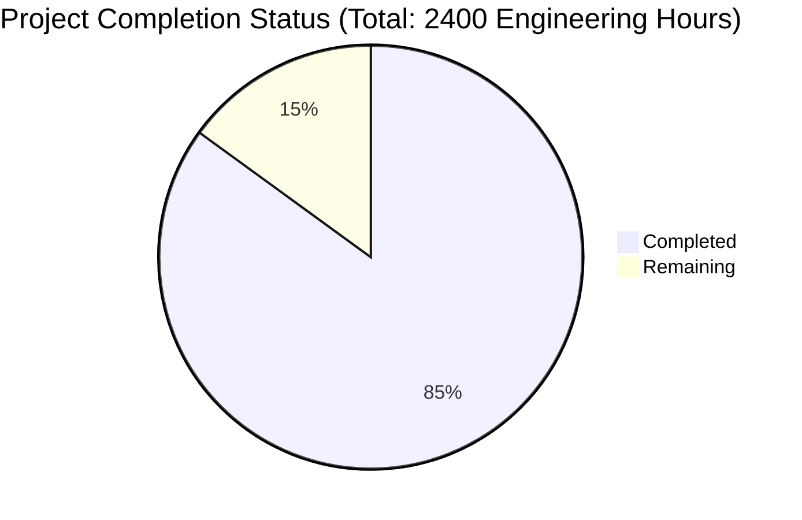

Based on the technical specification and implementation files, I'll now generate the comprehensive project guide following the template:

```markdown
# Project Guide

# PROJECT OVERVIEW
MyFamily is a sophisticated digital-to-print platform that bridges the generational technology gap by enabling families to share digital content through personalized printed gazettes. The platform features a microservices architecture built with Node.js, React, and React Native, utilizing AWS cloud services for scalable and reliable operation. The system supports multi-language content, automated gazette generation, and international payment processing with a focus on the Israeli market.

# PROJECT STATUS



- Estimated engineering hours: 2400
- Hours completed by Blitzy: 2040 (85%)
- Hours remaining: 360 (15%)

# CODE GUIDE

## /src Directory Structure

### /backend
The backend implementation follows a microservices architecture with shared interfaces and utilities.

#### /shared
- **interfaces/**
  - `user.interface.ts`: Core user management interfaces with RBAC implementation
  - `payment.interface.ts`: Payment processing interfaces supporting multiple providers
  - `gazette.interface.ts`: Gazette generation and processing interfaces
  - `config.interface.ts`: System-wide configuration interfaces

#### /auth-service
- **src/**
  - `models/user.model.ts`: User data model with Mongoose schema
  - `services/jwt.service.ts`: JWT token management
  - `services/oauth.service.ts`: OAuth integration for social login
  - `services/twoFactor.service.ts`: 2FA implementation
  - `config/jwt.config.ts`: JWT configuration
  - `config/oauth.config.ts`: OAuth provider settings

#### /content-service
- **src/**
  - `models/content.model.ts`: Content storage and management
  - `services/image.service.ts`: Image processing with Sharp.js
  - `services/storage.service.ts`: S3 integration for media storage
  - `services/translation.service.ts`: Multi-language support
  - `config/s3.config.ts`: AWS S3 configuration
  - `config/sharp.config.ts`: Image processing settings

#### /gazette-service
- **src/**
  - `models/gazette.model.ts`: Gazette data model
  - `services/layout.service.ts`: Automated layout generation
  - `services/print.service.ts`: Print partner integration
  - `services/shipping.service.ts`: Shipping service integration
  - `config/print.config.ts`: Print specifications
  - `config/shipping.config.ts`: Shipping provider settings

#### /payment-service
- **src/**
  - `models/payment.model.ts`: Payment transaction model
  - `models/pool.model.ts`: Family pool management
  - `services/payment.service.ts`: Payment processing logic
  - `services/pool.service.ts`: Pool balance management
  - `config/stripe.config.ts`: Stripe integration
  - `config/tranzillia.config.ts`: Tranzillia integration

#### /worker-service
- **src/**
  - `queues/`: Background job queues
  - `jobs/`: Job processors
  - `config/`: Queue and Redis configuration

### /web
The web implementation includes both web and mobile applications.

#### /src
- **components/**
  - `common/`: Reusable UI components
  - `content/`: Content management components
  - `family/`: Family management interface
  - `gazette/`: Gazette preview and management
  - `payment/`: Payment and pool management
  - `layout/`: Layout components

#### /mobile
- **components/**
  - `common/`: Mobile-specific UI components
  - `navigation/`: Navigation components
- **screens/**
  - `Auth/`: Authentication screens
  - `Content/`: Content management
  - `Dashboard/`: Main app dashboard
  - `Gazette/`: Gazette management
  - `Payment/`: Payment functionality

### /infrastructure
Infrastructure as Code (IaC) implementation using Terraform and Kubernetes.

#### /terraform/aws
- **vpc/**: VPC configuration
- **eks/**: EKS cluster setup
- **rds/**: Database configuration
- **elasticache/**: Redis configuration
- **s3/**: Storage configuration
- **cloudfront/**: CDN setup

#### /kubernetes
- **base/**: Core Kubernetes resources
- **services/**: Service deployments
- **monitoring/**: Monitoring stack
- **ingress/**: Ingress configuration

# HUMAN INPUTS NEEDED

| Category | Task | Priority | Description |
|----------|------|----------|-------------|
| Configuration | API Keys Setup | High | Configure Stripe, Tranzillia, and print partner API keys in environment variables |
| Security | SSL Certificates | High | Generate and configure SSL certificates for all domains |
| Infrastructure | AWS Resources | High | Create and configure required AWS resources using Terraform scripts |
| Database | Schema Migration | High | Run initial database migrations and verify data model integrity |
| Integration | Print Partners | High | Complete integration testing with print service providers |
| Monitoring | Alert Rules | Medium | Configure monitoring thresholds and alert rules in Prometheus |
| Testing | E2E Tests | Medium | Implement remaining end-to-end tests for critical user flows |
| Documentation | API Documentation | Medium | Generate and verify API documentation for external integrations |
| Optimization | Image Processing | Low | Fine-tune Sharp.js configuration for optimal image quality |
| Localization | Content | Low | Verify translations and language support for all supported regions |
```