# Technical Specifications

# 1. INTRODUCTION

## 1.1 Executive Summary

MyFamily is an innovative digital-to-print platform designed to bridge the generational technology gap by enabling families to share digital content through personalized printed gazettes. The system addresses the critical challenge of maintaining meaningful connections between tech-savvy family members and their less digitally-oriented elderly relatives. Primary stakeholders include family content contributors (ages 25-50), elderly recipients (65+), and printing/distribution partners. The platform is expected to strengthen family bonds, reduce senior isolation, and create lasting physical mementos of family moments.

## 1.2 System Overview

### Project Context

| Aspect | Description |
|--------|-------------|
| Market Position | Premium family communication service targeting multi-generational, globally distributed families |
| Current Limitations | Existing social platforms exclude non-digital users; physical photo sharing is manual and inconsistent |
| Enterprise Integration | Standalone platform with integration points for printing, payment, and shipping services |

### High-Level Description

The system comprises three major components:

1. Digital Platform
- React/React Native applications for web and mobile
- Node.js backend with PostgreSQL database
- AWS S3 media storage with CloudFront CDN

2. Content Processing Pipeline
- Automated layout generation
- Multi-calendar integration
- Multi-language support across 8 languages
- Quality assurance automation

3. Production System
- Professional printing service integration
- International distribution network
- Family pool payment processing
- Promotional code management

### Success Criteria

| Category | Metrics |
|----------|---------|
| User Engagement | - 80% monthly active families<br>- 15+ photos per gazette average<br>- < 5% subscription churn rate |
| Technical Performance | - 99.9% platform uptime<br>- < 3s page load time<br>- 100% gazette delivery accuracy |
| Business Metrics | - 70% family pool utilization<br>- 25% promotional code conversion<br>- 95% recipient satisfaction |

## 1.3 Scope

### In-Scope Elements

| Category | Components |
|----------|------------|
| Core Features | - Family account management<br>- Content upload and curation<br>- Automated gazette generation<br>- Multi-currency payment processing<br>- International shipping |
| User Groups | - Family administrators<br>- Content contributors<br>- Elderly recipients<br>- System administrators |
| Geographic Coverage | - Israel (primary market)<br>- Europe<br>- North America<br>- Australia |
| Data Domains | - User profiles<br>- Family content<br>- Financial transactions<br>- Shipping information |

### Out-of-Scope Elements

- Social network features beyond family groups
- Video content processing
- Mobile app push notifications
- Direct messaging between members
- Custom gazette templates
- Real-time content collaboration
- Third-party content imports
- API access for external developers

# 2. SYSTEM ARCHITECTURE

## 2.1 High-Level Architecture

```mermaid
C4Context
    title System Context Diagram - MyFamily Platform

    Person(family, "Family Members", "Content contributors using web/mobile apps")
    Person(recipient, "Recipients", "Elderly relatives receiving printed gazettes")
    Person(admin, "Administrators", "System and family administrators")

    System_Boundary(myfamily, "MyFamily Platform") {
        System(webapp, "Web Application", "React.js frontend for content management")
        System(mobile, "Mobile Apps", "React Native iOS/Android apps")
        System(api, "Core API", "Node.js backend services")
        System(worker, "Background Workers", "Content processing and gazette generation")
    }

    System_Ext(print, "Print Services", "Professional printing partners")
    System_Ext(payment, "Payment Processors", "Stripe & Tranzillia")
    System_Ext(shipping, "Shipping Services", "International delivery network")
    System_Ext(storage, "AWS S3", "Media storage")
    System_Ext(cdn, "CloudFront", "Content delivery network")

    Rel(family, webapp, "Uses", "HTTPS")
    Rel(family, mobile, "Uses", "HTTPS")
    Rel(admin, webapp, "Manages", "HTTPS")
    Rel(myfamily, print, "Sends gazette PDFs", "HTTPS")
    Rel(print, shipping, "Delivers", "Physical")
    Rel(shipping, recipient, "Delivers gazette", "Mail")
    Rel(myfamily, payment, "Processes payments", "HTTPS")
    Rel(myfamily, storage, "Stores media", "HTTPS")
    Rel(myfamily, cdn, "Delivers content", "HTTPS")
```

## 2.2 Container Architecture

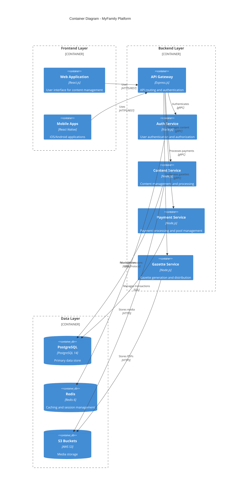

## 2.3 Component Architecture

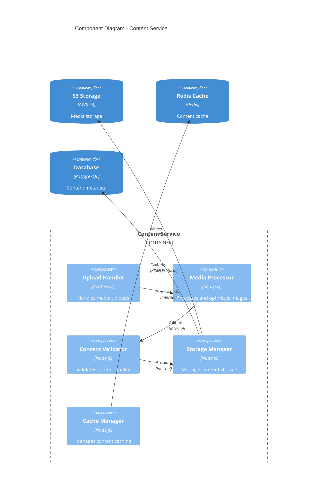

## 2.4 Data Flow Architecture

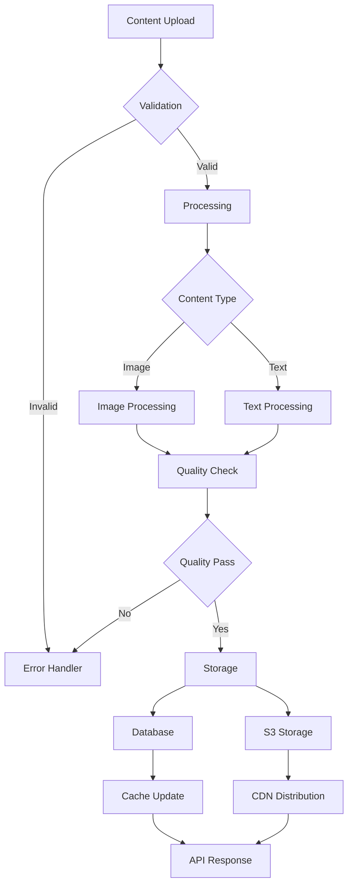

## 2.5 Deployment Architecture

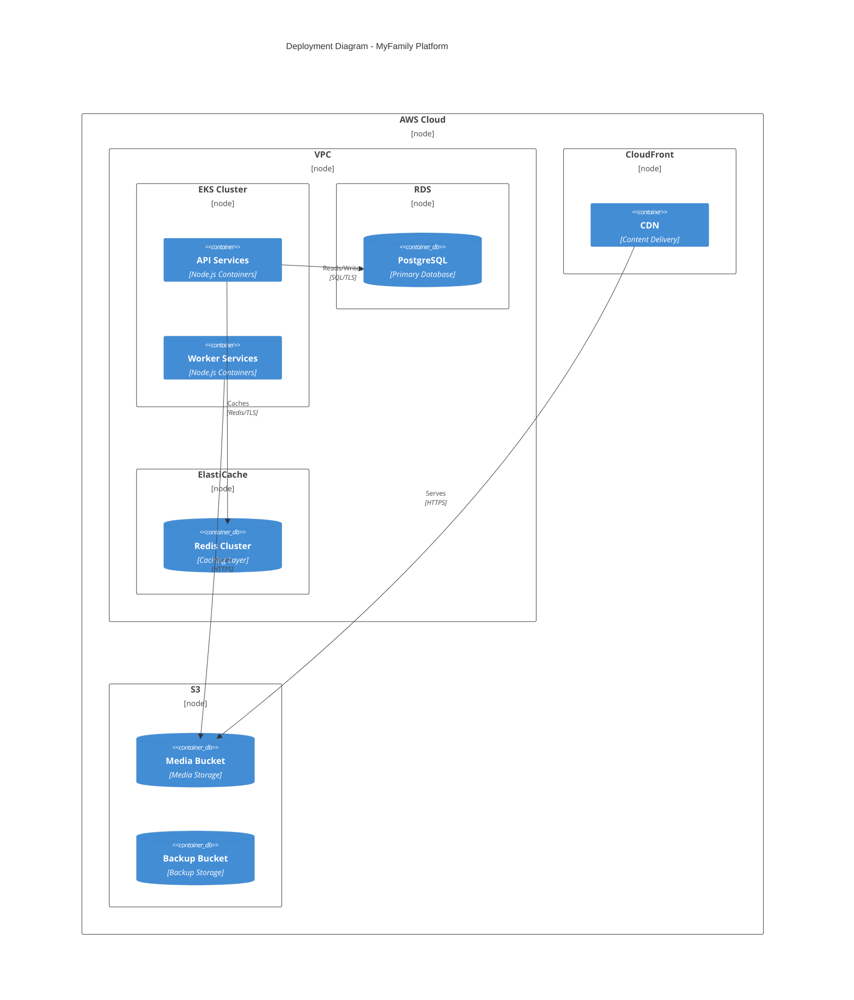

## 2.6 Technical Decisions

### 2.6.1 Architecture Style
- Microservices architecture chosen for:
  - Independent scaling of components
  - Technology flexibility per service
  - Isolated deployment and testing
  - Fault isolation

### 2.6.2 Communication Patterns
| Pattern | Usage | Justification |
|---------|--------|--------------|
| REST | External APIs | Industry standard, wide tooling support |
| gRPC | Internal Services | High performance, strong typing |
| Event-driven | Background Tasks | Decoupling, scalability |
| WebSocket | Real-time Updates | Efficient bi-directional communication |

### 2.6.3 Data Storage Solutions
| Store | Purpose | Justification |
|-------|---------|--------------|
| PostgreSQL | Primary Data | ACID compliance, relational integrity |
| Redis | Caching | High performance, distributed caching |
| S3 | Media Storage | Scalable, cost-effective binary storage |
| ElastiCache | Session Management | Distributed session handling |

## 2.7 Cross-Cutting Concerns

### 2.7.1 Monitoring and Observability
- ELK Stack for log aggregation
- Prometheus for metrics collection
- Grafana for visualization
- Jaeger for distributed tracing
- CloudWatch for AWS resource monitoring

### 2.7.2 Security Architecture
- JWT-based authentication
- Role-based access control (RBAC)
- TLS 1.3 for all communications
- AWS WAF for DDoS protection
- VPC isolation for internal services

### 2.7.3 Disaster Recovery
| Component | RPO | RTO | Strategy |
|-----------|-----|-----|-----------|
| Database | 1 hour | 4 hours | Multi-AZ deployment |
| Media Storage | 24 hours | 2 hours | Cross-region replication |
| Application | 0 minutes | 5 minutes | Blue-green deployment |
| Cache | 0 minutes | 1 minute | Redis cluster with replicas |

# 3. SYSTEM COMPONENTS ARCHITECTURE

## 3.1 User Interface Design

### 3.1.1 Design System Specifications

| Component | Specification | Implementation Details |
|-----------|--------------|----------------------|
| Typography | Roboto Family | - Primary: Roboto Regular (16px)<br>- Headers: Roboto Bold (24px, 20px, 18px)<br>- RTL: Noto Sans Hebrew |
| Color Palette | Material Design 3.0 | - Primary: #2196F3<br>- Secondary: #FFC107<br>- Error: #F44336<br>- Success: #4CAF50 |
| Spacing System | 8px Base Grid | - Margins: 16px, 24px, 32px<br>- Padding: 8px, 16px, 24px<br>- Component spacing: 16px |
| Breakpoints | Mobile-First | - Mobile: 320px-767px<br>- Tablet: 768px-1023px<br>- Desktop: 1024px+ |

### 3.1.2 Component Library

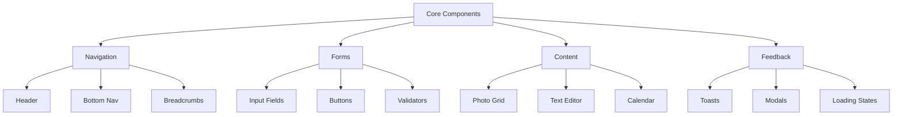

### 3.1.3 Critical User Flows

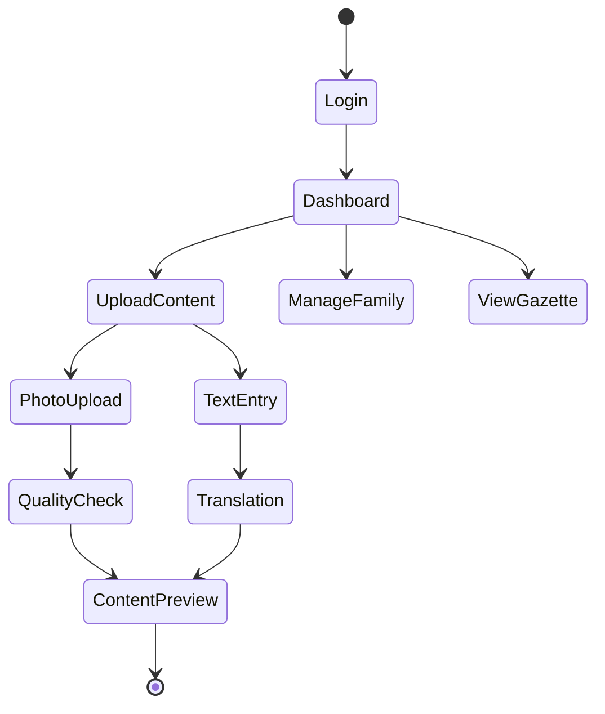

## 3.2 Database Design

### 3.2.1 Schema Design

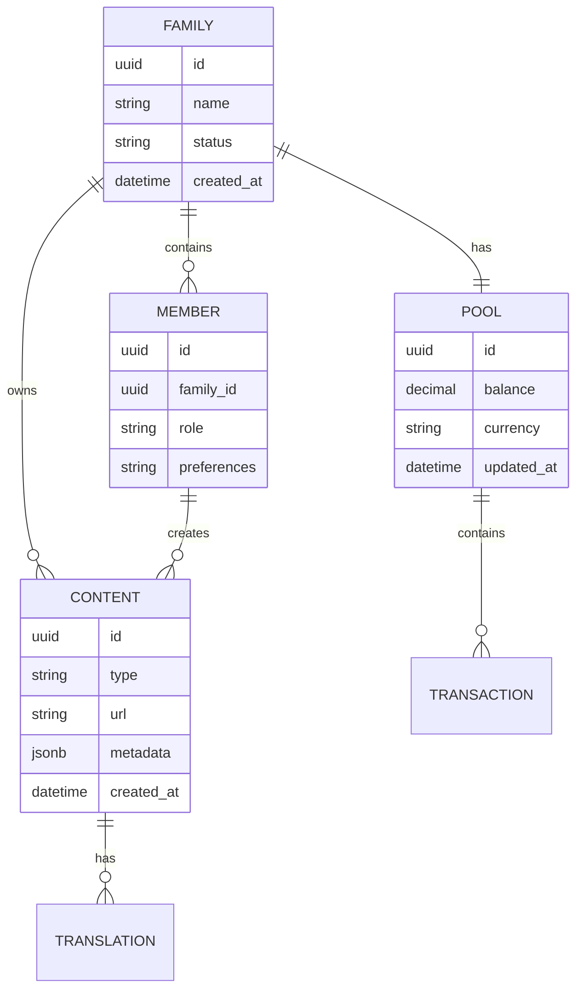

### 3.2.2 Indexing Strategy

| Table | Index Type | Columns | Purpose |
|-------|------------|---------|---------|
| FAMILY | B-tree | (id) | Primary key lookup |
| MEMBER | B-tree | (family_id, role) | Member role queries |
| CONTENT | B-tree | (family_id, created_at) | Content timeline |
| CONTENT | GiST | (metadata) | JSON field search |
| POOL | B-tree | (family_id, updated_at) | Balance tracking |

### 3.2.3 Partitioning Strategy

| Table | Partition Type | Key | Retention |
|-------|---------------|-----|-----------|
| CONTENT | Range | created_at | 24 months |
| TRANSACTION | Range | created_at | 84 months |
| AUDIT_LOG | Range | timestamp | 12 months |

## 3.3 API Design

### 3.3.1 API Architecture

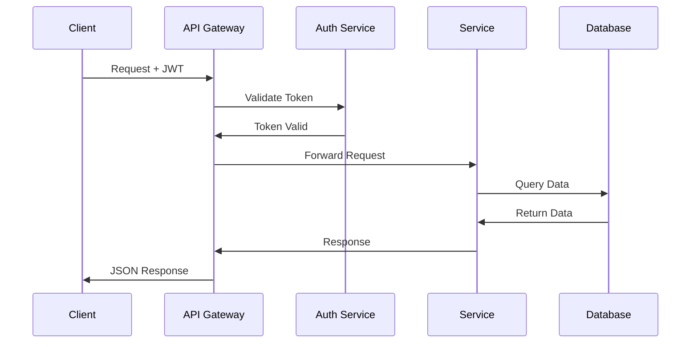

### 3.3.2 Endpoint Specifications

| Endpoint | Method | Auth | Rate Limit | Cache |
|----------|--------|------|------------|-------|
| /api/v1/families | GET | JWT | 1000/hour | 5 min |
| /api/v1/content | POST | JWT | 100/min | No |
| /api/v1/gazettes | GET | JWT | 500/hour | 15 min |
| /api/v1/pool | PUT | JWT | 50/min | No |

### 3.3.3 Response Format

```json
{
  "status": "success|error",
  "data": {
    "id": "uuid",
    "type": "string",
    "attributes": {},
    "relationships": {}
  },
  "meta": {
    "timestamp": "ISO8601",
    "version": "string"
  }
}
```

### 3.3.4 Integration Patterns

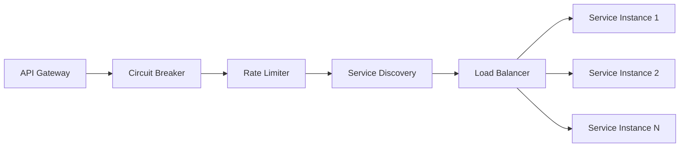

### 3.3.5 Security Controls

| Control | Implementation | Purpose |
|---------|---------------|---------|
| Authentication | JWT + OAuth2 | Identity verification |
| Authorization | RBAC | Access control |
| Rate Limiting | Token bucket | Abuse prevention |
| Input Validation | JSON Schema | Data integrity |
| SSL/TLS | TLS 1.3 | Transport security |
| API Keys | UUID v4 | Client identification |

# 4. TECHNOLOGY STACK

## 4.1 PROGRAMMING LANGUAGES

| Layer | Language | Version | Justification |
|-------|----------|---------|---------------|
| Frontend Web | JavaScript/TypeScript | TS 4.9+ | - Strong typing for complex family data structures<br>- Enhanced IDE support<br>- Better maintainability |
| Frontend Mobile | JavaScript/TypeScript | TS 4.9+ | - Code sharing with web platform<br>- Consistent development experience |
| Backend | Node.js | 18 LTS | - JavaScript ecosystem alignment<br>- Excellent async processing for content handling<br>- Rich NPM package ecosystem |
| Database Scripts | SQL | PostgreSQL 14+ | - Complex family relationship queries<br>- Transaction management for payment system |

## 4.2 FRAMEWORKS & LIBRARIES

### 4.2.1 Frontend Core

| Framework | Version | Purpose | Justification |
|-----------|---------|---------|---------------|
| React | 18.2+ | Web UI | - Component reusability<br>- Virtual DOM for gazette previews<br>- Large ecosystem |
| React Native | 0.71+ | Mobile Apps | - Code sharing with web<br>- Native performance<br>- Cross-platform support |
| Material UI | 5.11+ | UI Components | - RTL support<br>- Accessibility compliance<br>- Consistent theming |
| Redux Toolkit | 1.9+ | State Management | - Complex family data management<br>- Predictable state updates |

### 4.2.2 Backend Core

| Framework | Version | Purpose | Justification |
|-----------|---------|---------|---------------|
| Express.js | 4.18+ | API Server | - REST API implementation<br>- Middleware ecosystem<br>- Performance |
| Sharp | 0.31+ | Image Processing | - High-performance image manipulation<br>- Memory efficient<br>- Print-ready output |
| Prisma | 4.9+ | ORM | - Type-safe database queries<br>- Migration management<br>- Multi-database support |
| Bull | 4.10+ | Job Queue | - Gazette generation queue<br>- Redis-backed reliability<br>- Schedule management |

## 4.3 DATABASES & STORAGE

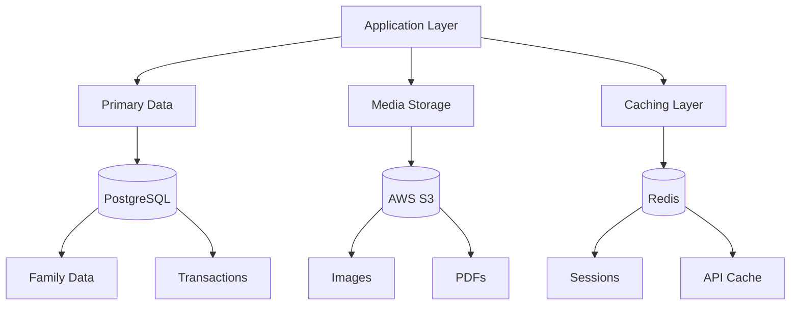

### 4.3.1 Primary Database
- PostgreSQL 14+
  - Family relationship modeling
  - JSONB for flexible content storage
  - Strong transaction support for payments
  - Partitioning for content scaling

### 4.3.2 Storage Services
- AWS S3
  - Media asset storage
  - Gazette PDF storage
  - Backup retention
  - CloudFront CDN integration

### 4.3.3 Caching Layer
- Redis 6.2+
  - Session management
  - API response caching
  - Queue management
  - Real-time updates

## 4.4 THIRD-PARTY SERVICES

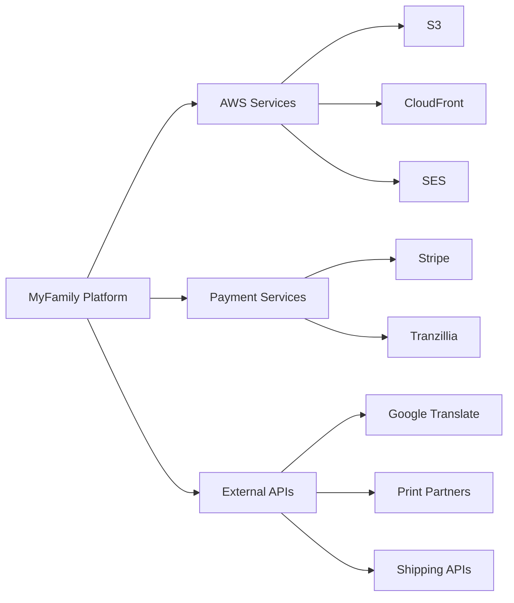

### 4.4.1 Cloud Services
- AWS Suite
  - EC2: Application hosting
  - S3: Media storage
  - CloudFront: CDN
  - SES: Email delivery
  - CloudWatch: Monitoring

### 4.4.2 External APIs
| Service | Purpose | Integration Method |
|---------|---------|-------------------|
| Stripe | International payments | REST API / Webhooks |
| Tranzillia | Israeli payments | REST API |
| Google Translate | Content translation | gRPC |
| Print Partners | Gazette production | REST API |
| Shipping Services | Delivery management | REST API |

## 4.5 DEVELOPMENT & DEPLOYMENT

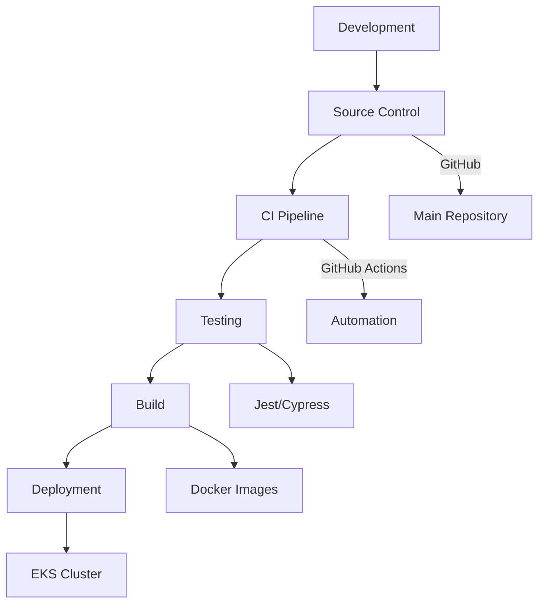

### 4.5.1 Development Tools
| Tool | Version | Purpose |
|------|---------|---------|
| VS Code | Latest | Primary IDE |
| ESLint | 8.33+ | Code quality |
| Prettier | 2.8+ | Code formatting |
| Jest | 29+ | Unit testing |
| Cypress | 12+ | E2E testing |

### 4.5.2 Build & Deployment
- Docker 20.10+
  - Multi-stage builds
  - Development containers
  - Production optimization

- Kubernetes 1.24+
  - EKS deployment
  - Auto-scaling
  - Rolling updates
  - Health monitoring

### 4.5.3 CI/CD Pipeline
- GitHub Actions
  - Automated testing
  - Docker image builds
  - Security scanning
  - Deployment automation

# 5. SYSTEM DESIGN

## 5.1 User Interface Design

### 5.1.1 Web Application Layout

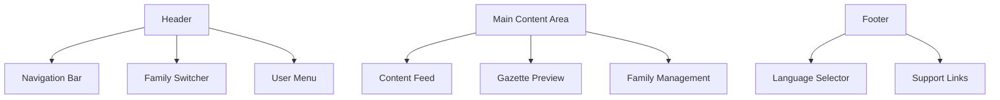

### 5.1.2 Mobile Application Layout

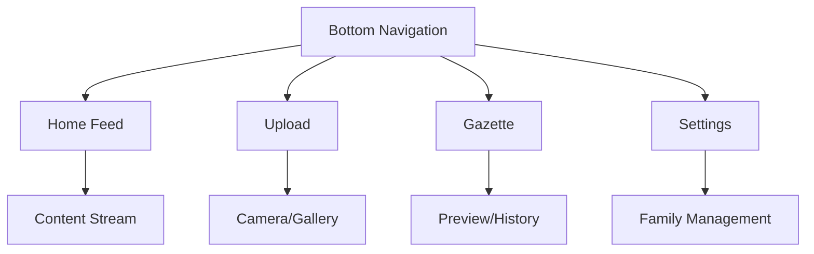

### 5.1.3 Key Interface Components

| Component | Description | Interactions |
|-----------|-------------|--------------|
| Family Switcher | Dropdown for active family selection | - Family list display<br>- Active family indicator<br>- Quick switch functionality |
| Content Upload | Multi-file upload interface | - Drag-and-drop support<br>- Progress indication<br>- Quality validation feedback |
| Gazette Preview | Interactive gazette mockup | - Page navigation<br>- Zoom controls<br>- Print preview |
| Family Pool Widget | Financial status display | - Balance indication<br>- Quick top-up<br>- Transaction history |

## 5.2 Database Design

### 5.2.1 Schema Overview

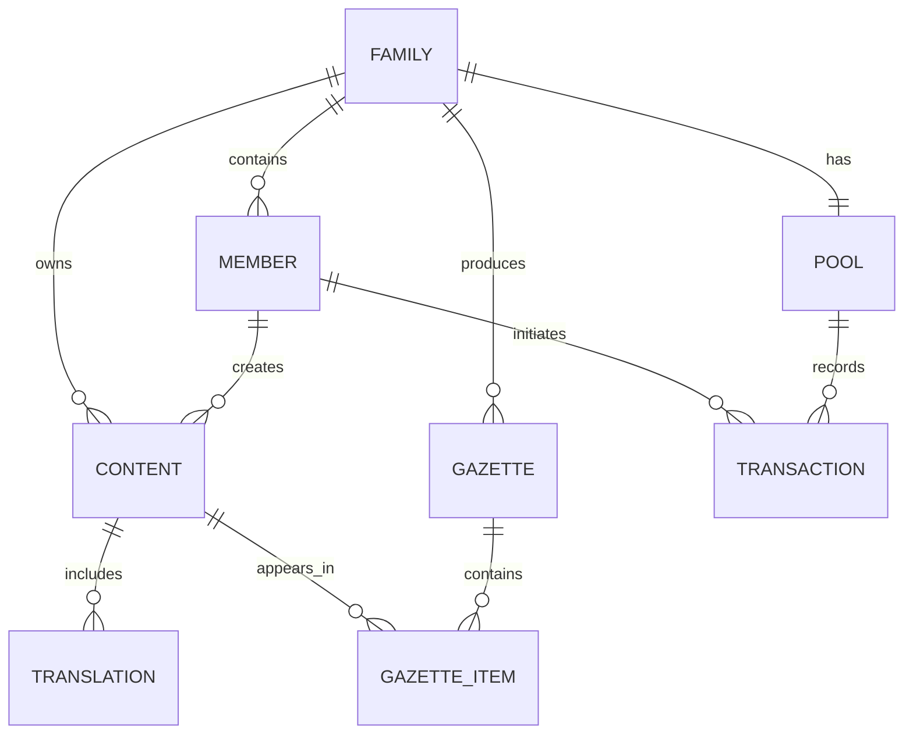

### 5.2.2 Table Specifications

| Table | Primary Key | Foreign Keys | Indexes | Partitioning |
|-------|-------------|--------------|---------|--------------|
| family | id (uuid) | - | name, created_at | None |
| member | id (uuid) | family_id | email, family_id | None |
| content | id (uuid) | family_id, creator_id | family_id, created_at | Range (created_at) |
| pool | id (uuid) | family_id | family_id | None |
| gazette | id (uuid) | family_id | family_id, generated_at | Range (generated_at) |

## 5.3 API Design

### 5.3.1 REST API Endpoints

| Endpoint | Method | Purpose | Authentication |
|----------|---------|---------|----------------|
| /api/v1/families | GET, POST | Family management | JWT |
| /api/v1/content | GET, POST | Content operations | JWT |
| /api/v1/gazettes | GET, POST | Gazette operations | JWT |
| /api/v1/pool | GET, PUT | Financial operations | JWT |

### 5.3.2 API Flow Architecture

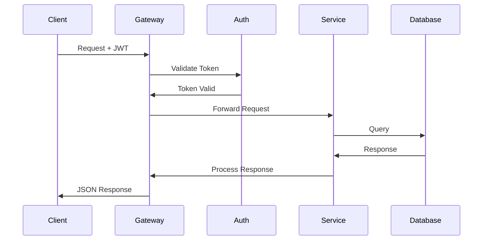

### 5.3.3 WebSocket Events

| Event | Direction | Purpose | Payload |
|-------|-----------|---------|---------|
| content.new | Server->Client | New content notification | Content metadata |
| gazette.status | Server->Client | Gazette status updates | Status details |
| pool.update | Server->Client | Pool balance changes | Transaction details |
| family.update | Server->Client | Family settings changes | Updated settings |

### 5.3.4 Integration Patterns

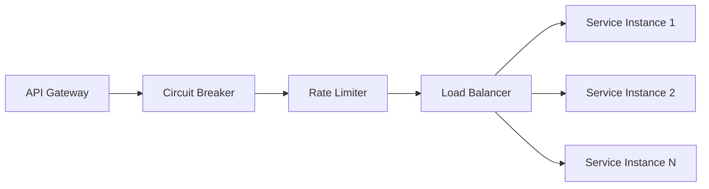

# 6. USER INTERFACE DESIGN

## 6.1 Design System

### 6.1.1 Component Library Key
```
Icons:
[?] - Help/Information tooltip
[$] - Financial/Payment related
[i] - Information display
[+] - Add new item
[x] - Close/Delete/Remove
[<] [>] - Navigation arrows
[^] - Upload content
[#] - Menu/Dashboard
[@] - User profile
[!] - Alert/Warning
[=] - Settings menu
[*] - Favorite/Important

Interactive Elements:
[ ] - Checkbox
( ) - Radio button
[Button] - Clickable button
[...] - Text input field
[====] - Progress indicator
[v] - Dropdown menu
```

## 6.2 Core Screens

### 6.2.1 Family Dashboard
```
+----------------------------------------------------------+
|  [@] John Doe    [#] Dashboard    [$] Family Pool    [=]  |
+----------------------------------------------------------+
|                                                           |
|  [*] Active Family: Smith Family [v]                      |
|                                                           |
|  +------------------+  +------------------+               |
|  | Next Gazette     |  | Family Pool      |               |
|  | 12 days left     |  | Balance: $120    |               |
|  | 8/28 photos      |  | [Add Funds]      |               |
|  +------------------+  +------------------+               |
|                                                           |
|  [+] Add Content                [^] Upload Photos         |
|                                                           |
|  Recent Activity:                                         |
|  +--------------------------------------------------+    |
|  | [i] Sarah added 3 photos                     [>]  |    |
|  | [i] David wrote a message                    [>]  |    |
|  | [$] Monthly gazette generated               [>]  |    |
|  +--------------------------------------------------+    |
|                                                           |
+----------------------------------------------------------+
```

### 6.2.2 Content Upload
```
+----------------------------------------------------------+
|  [<] Back to Dashboard                              [?]   |
+----------------------------------------------------------+
|                                                           |
|  Upload Content                                           |
|  +--------------------------------------------------+    |
|  |  [^]                                              |    |
|  |  Drag photos here or click to upload              |    |
|  |  Maximum 28 photos per gazette                    |    |
|  +--------------------------------------------------+    |
|                                                           |
|  Selected Photos: 3                                       |
|  [============================    ] 75%                   |
|                                                           |
|  Add Description:                                         |
|  +--------------------------------------------------+    |
|  | [......................................]          |    |
|  | 500 characters maximum                            |    |
|  +--------------------------------------------------+    |
|                                                           |
|  Language: [v] English                                    |
|  Auto-translate: [ ] Yes                                  |
|                                                           |
|  [Cancel]                          [Upload and Share]     |
|                                                           |
+----------------------------------------------------------+
```

### 6.2.3 Family Pool Management
```
+----------------------------------------------------------+
|  [<] Back to Dashboard                              [?]   |
+----------------------------------------------------------+
|                                                           |
|  Family Pool Balance                                      |
|  +--------------------------------------------------+    |
|  |  Current Balance: $120                            |    |
|  |  Next Charge: $70 (May 2024 Gazette)             |    |
|  |  [Add Funds]                                     |    |
|  +--------------------------------------------------+    |
|                                                           |
|  Payment Methods:                                         |
|  ( ) Family Pool Balance                                  |
|  ( ) Credit Card ending in 4242                          |
|  [+] Add Payment Method                                  |
|                                                           |
|  Recent Transactions:                                     |
|  +--------------------------------------------------+    |
|  | [i] April Gazette Payment     -$70    04/01/24   |    |
|  | [i] Pool Deposit (Sarah)      +$100   03/15/24   |    |
|  | [i] March Gazette Payment     -$70    03/01/24   |    |
|  +--------------------------------------------------+    |
|                                                           |
+----------------------------------------------------------+
```

### 6.2.4 Gazette Preview
```
+----------------------------------------------------------+
|  [<] Back to Dashboard          [Print Preview]    [?]    |
+----------------------------------------------------------+
|                                                           |
|  May 2024 Gazette Preview                                 |
|  +--------------------------------------------------+    |
|  |  +----------------+  +----------------+           |    |
|  |  | Cover Photo    |  | Page 2         |          |    |
|  |  |                |  | Family Events   |          |    |
|  |  |                |  | Birthdays       |          |    |
|  |  +----------------+  +----------------+           |    |
|  |                                                  |    |
|  |  [<] 1/8 [>]                                    |    |
|  +--------------------------------------------------+    |
|                                                           |
|  Layout Options:                                          |
|  ( ) Classic                                              |
|  ( ) Modern                                               |
|  ( ) Compact                                              |
|                                                           |
|  [Save Draft]                    [Approve for Print]      |
|                                                           |
+----------------------------------------------------------+
```

## 6.3 Mobile Views

### 6.3.1 Mobile Dashboard
```
+----------------------+
| [@] [$] [#] [=]     |
+----------------------+
| Smith Family [v]     |
|                      |
| Quick Actions:       |
| [^] Upload           |
| [+] Write            |
| [*] Preview          |
|                      |
| Recent Updates:      |
| +------------------+ |
| | New photos (3)   | |
| | Sarah - 2h ago   | |
| +------------------+ |
| | Message added    | |
| | David - 5h ago   | |
| +------------------+ |
|                      |
| [====] 8/28 photos   |
| 12 days until print  |
+----------------------+
```

### 6.3.2 Mobile Upload
```
+----------------------+
| [<] Upload  [?]     |
+----------------------+
|                      |
| [^]                 |
| Tap to upload       |
|                      |
| Selected: 2 photos   |
| [===========    ]    |
|                      |
| Description:         |
| [..................] |
|                      |
| Language: [v]        |
| [ ] Auto-translate   |
|                      |
| [Share Photos]       |
+----------------------+
```

# 7. SECURITY CONSIDERATIONS

## 7.1 Authentication and Authorization

### 7.1.1 Authentication Methods

| Method | Implementation | Use Case |
|--------|----------------|----------|
| JWT Tokens | JSON Web Tokens with 24h expiry | Primary API authentication |
| OAuth 2.0 | Google OAuth integration | Social login |
| 2FA | SMS/Email verification codes | Account security |
| Biometric | Native iOS/Android integration | Mobile app login |
| API Keys | UUID v4 tokens | Print partner integration |

### 7.1.2 Authorization Matrix

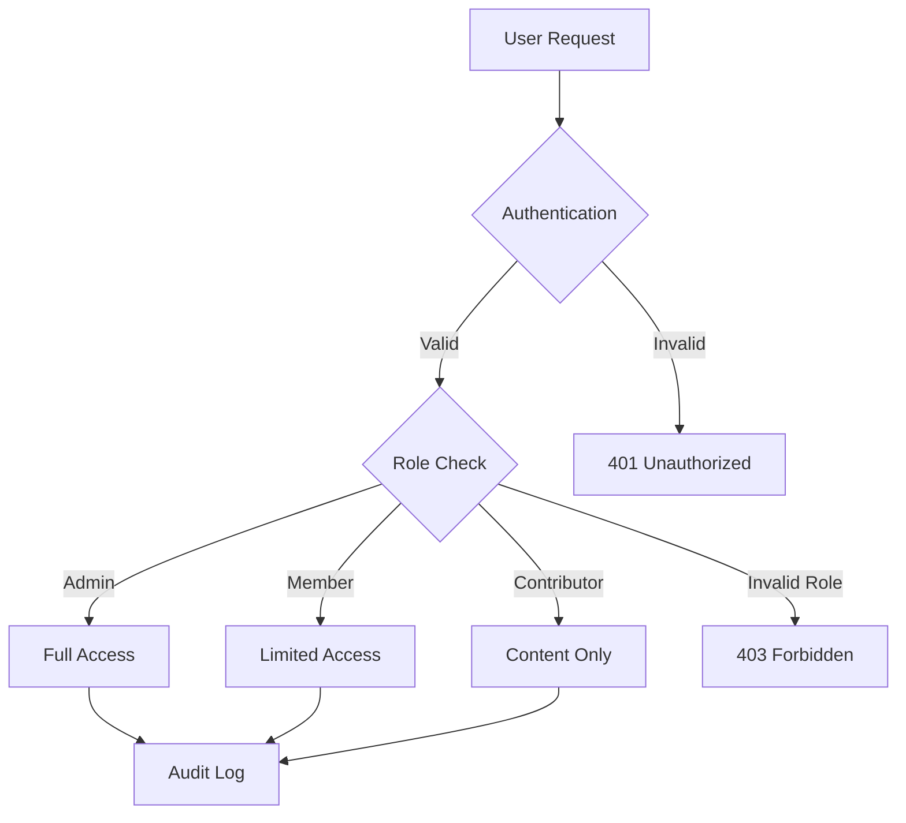

### 7.1.3 Role-Based Access Control

| Role | Permissions | Scope |
|------|------------|-------|
| Family Admin | - Manage members<br>- Configure settings<br>- Access pool<br>- Delete content | Single family |
| Content Contributor | - Upload content<br>- Edit own content<br>- View gazette | Assigned families |
| Member | - View content<br>- Add comments<br>- View pool | Assigned families |
| System Admin | - All permissions<br>- System configuration<br>- User management | Platform-wide |

## 7.2 Data Security

### 7.2.1 Encryption Standards

| Data State | Method | Key Management |
|------------|--------|----------------|
| At Rest | AES-256-GCM | AWS KMS |
| In Transit | TLS 1.3 | Managed certificates |
| Database | Transparent Data Encryption | PostgreSQL native |
| File Storage | S3 Server-Side Encryption | S3-Managed Keys |
| Backups | AES-256 | Offline key storage |

### 7.2.2 Data Classification

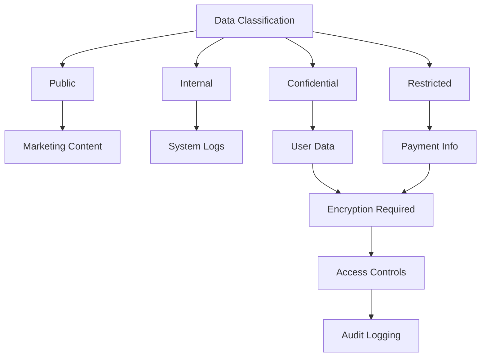

### 7.2.3 Personal Data Protection

| Data Type | Protection Method | Access Control |
|-----------|------------------|----------------|
| Email Addresses | Hashed display, encrypted storage | Role-based |
| Payment Details | PCI DSS compliant storage | Payment service only |
| Photos | Access-controlled S3 buckets | Family members |
| Address Information | Encrypted at rest | Shipping service |
| Children's Data | Special protection category | Parent-authorized |

## 7.3 Security Protocols

### 7.3.1 Network Security

```mermaid
flowchart LR
    A[Internet] --> B[WAF]
    B --> C[Load Balancer]
    C --> D[API Gateway]
    D --> E[VPC]
    E --> F[Application Tier]
    E --> G[Database Tier]
    
    H[Security Groups] --> E
    I[NACL] --> E
```

### 7.3.2 Security Monitoring

| Component | Tool | Purpose |
|-----------|------|---------|
| Log Analysis | ELK Stack | Security event monitoring |
| Intrusion Detection | AWS GuardDuty | Threat detection |
| Vulnerability Scanning | AWS Inspector | Security assessment |
| DDoS Protection | AWS Shield | Attack mitigation |
| API Monitoring | CloudWatch | Request analysis |

### 7.3.3 Security Compliance

| Standard | Implementation | Verification |
|----------|----------------|--------------|
| GDPR | Data privacy controls | Annual audit |
| CCPA | User consent management | Quarterly review |
| PCI DSS | Payment data security | Monthly scan |
| ISO 27001 | Information security | External audit |
| OWASP Top 10 | Security controls | Penetration testing |

### 7.3.4 Incident Response

```mermaid
stateDiagram-v2
    [*] --> Detection
    Detection --> Analysis
    Analysis --> Containment
    Containment --> Eradication
    Eradication --> Recovery
    Recovery --> PostIncident
    PostIncident --> [*]
```

| Phase | Actions | Responsible Team |
|-------|---------|-----------------|
| Detection | Monitor alerts, Log analysis | Security Operations |
| Analysis | Threat assessment, Impact evaluation | Security Team |
| Containment | Isolate affected systems, Block threats | DevOps |
| Eradication | Remove threat, Patch vulnerabilities | Development Team |
| Recovery | Restore services, Verify security | Operations |
| Post-Incident | Document lessons, Update procedures | Security Management |

# 8. INFRASTRUCTURE

## 8.1 DEPLOYMENT ENVIRONMENT

```mermaid
flowchart TD
    A[Production Environment] --> B[AWS Cloud]
    A --> C[Print Partner Network]
    
    B --> D[Primary Region]
    B --> E[Backup Region]
    
    D --> F[VPC]
    F --> G[Public Subnet]
    F --> H[Private Subnet]
    
    G --> I[Load Balancers]
    G --> J[Bastion Hosts]
    
    H --> K[Application Tier]
    H --> L[Database Tier]
    H --> M[Cache Tier]
```

| Environment | Purpose | Configuration |
|-------------|---------|---------------|
| Production | Live system serving end users | - Multi-AZ deployment<br>- Auto-scaling enabled<br>- Full monitoring suite |
| Staging | Pre-production testing | - Single-AZ deployment<br>- Limited scaling<br>- Full monitoring |
| Development | Development and testing | - Single-AZ deployment<br>- Minimal resources<br>- Basic monitoring |
| DR | Disaster recovery | - Cross-region setup<br>- Warm standby<br>- Full replication |

## 8.2 CLOUD SERVICES

| Service | Usage | Justification |
|---------|-------|--------------|
| AWS EKS | Container orchestration | - Managed Kubernetes<br>- Auto-scaling support<br>- Multi-AZ capability |
| AWS RDS | PostgreSQL database | - Managed database service<br>- Automated backups<br>- High availability |
| AWS ElastiCache | Redis caching | - Managed Redis service<br>- Multi-AZ replication<br>- Automatic failover |
| AWS S3 | Media storage | - Scalable object storage<br>- Lifecycle management<br>- Cross-region replication |
| CloudFront | CDN | - Global content delivery<br>- Edge caching<br>- SSL/TLS support |
| AWS SES | Email delivery | - Reliable email service<br>- High deliverability<br>- Template support |

## 8.3 CONTAINERIZATION

```mermaid
flowchart LR
    A[Application Components] --> B[Base Images]
    B --> C[Development Images]
    B --> D[Production Images]
    
    C --> E[Local Development]
    C --> F[CI/CD Pipeline]
    
    D --> G[Staging]
    D --> H[Production]
    
    I[Docker Registry] --> G
    I --> H
```

### 8.3.1 Docker Configuration

| Component | Base Image | Optimizations |
|-----------|------------|---------------|
| Frontend | node:18-alpine | - Multi-stage builds<br>- NPM cache layers<br>- Production dependencies only |
| Backend | node:18-alpine | - Multi-stage builds<br>- Minimal dependencies<br>- Security scanning |
| Workers | node:18-alpine | - Process-specific builds<br>- Optimized for CPU/Memory<br>- Minimal attack surface |

## 8.4 ORCHESTRATION

```mermaid
flowchart TD
    A[EKS Cluster] --> B[Node Groups]
    B --> C[System Pods]
    B --> D[Application Pods]
    
    C --> E[Monitoring]
    C --> F[Logging]
    C --> G[Service Mesh]
    
    D --> H[Frontend]
    D --> I[Backend]
    D --> J[Workers]
```

### 8.4.1 Kubernetes Configuration

| Resource | Configuration | Purpose |
|----------|--------------|----------|
| Namespaces | - production<br>- staging<br>- system | Environment isolation |
| Node Groups | - application: t3.large<br>- workers: c5.xlarge | Workload optimization |
| Auto-scaling | - Min: 3 nodes<br>- Max: 10 nodes<br>- Target CPU: 70% | Resource efficiency |
| Storage Classes | - gp3-encrypted<br>- io1-encrypted | Performance tiers |

## 8.5 CI/CD PIPELINE

```mermaid
flowchart LR
    A[Source Code] --> B[GitHub Actions]
    B --> C{Tests Pass?}
    C -->|Yes| D[Build Images]
    C -->|No| E[Notify Team]
    
    D --> F[Security Scan]
    F --> G{Scan Pass?}
    G -->|Yes| H[Deploy Staging]
    G -->|No| E
    
    H --> I{Staging Tests}
    I -->|Pass| J[Deploy Production]
    I -->|Fail| E
    
    J --> K[Post-Deploy Tests]
    K --> L[Monitor]
```

### 8.5.1 Pipeline Stages

| Stage | Tools | Actions |
|-------|-------|---------|
| Code Quality | - ESLint<br>- Prettier<br>- SonarQube | - Syntax checking<br>- Style enforcement<br>- Code analysis |
| Testing | - Jest<br>- Cypress<br>- k6 | - Unit tests<br>- Integration tests<br>- Performance tests |
| Security | - Snyk<br>- OWASP ZAP<br>- Trivy | - Dependency scanning<br>- Container scanning<br>- Dynamic analysis |
| Deployment | - Helm<br>- ArgoCD<br>- Terraform | - Chart deployment<br>- GitOps sync<br>- Infrastructure as Code |
| Monitoring | - Prometheus<br>- Grafana<br>- ELK Stack | - Metrics collection<br>- Visualization<br>- Log aggregation |

# 8. APPENDICES

## 8.1 Additional Technical Information

### 8.1.1 Print Production Specifications

| Parameter | Specification | Notes |
|-----------|--------------|--------|
| Page Size | A4 (210×297mm) | ISO 216 standard |
| Color Space | CMYK | Fogra39 color profile |
| Resolution | 300 DPI minimum | For photo quality |
| Bleed | 3mm | All edges |
| Binding | Perfect binding | For durability |
| Paper Stock | 150gsm interior, 250gsm cover | Acid-free paper |

### 8.1.2 Image Processing Pipeline

```mermaid
flowchart TD
    A[Image Upload] --> B[Initial Validation]
    B --> C{Format Check}
    C -->|Valid| D[Resolution Check]
    C -->|Invalid| E[Error Response]
    
    D -->|Pass| F[Color Space Conversion]
    D -->|Fail| E
    
    F --> G[Compression]
    G --> H[Metadata Extraction]
    H --> I[Storage]
    
    I --> J[CDN Distribution]
    I --> K[Print Queue]
```

### 8.1.3 Calendar System Integration

| Calendar | Date Handling | Event Mapping |
|----------|--------------|---------------|
| Gregorian | Base calendar | Direct mapping |
| Hebrew | 5784-5785 | Automatic conversion |
| Islamic | 1445-1446 | Lunar calculation |
| Chinese | 4721-4722 | Traditional festivals |

## 8.2 Glossary

| Term | Definition |
|------|------------|
| Gazette | Monthly curated family newsletter in printed format |
| Family Pool | Shared financial account for gazette expenses |
| Content Curator | Automated system for content organization |
| Print Partner | Third-party printing service provider |
| Payment Cascade | Automated payment processing sequence |
| Quality Gate | Automated content quality validation checkpoint |
| Layout Engine | Automated gazette composition system |
| Distribution Node | Geographic print and shipping center |
| Content Feed | Chronological display of family updates |
| Translation Memory | Database of previous translations |

## 8.3 Acronyms

| Acronym | Full Form |
|---------|-----------|
| API | Application Programming Interface |
| AWS | Amazon Web Services |
| CDN | Content Delivery Network |
| CMYK | Cyan, Magenta, Yellow, Key (Black) |
| DPI | Dots Per Inch |
| EKS | Elastic Kubernetes Service |
| GDPR | General Data Protection Regulation |
| JWT | JSON Web Token |
| OAuth | Open Authorization |
| PITR | Point-In-Time Recovery |
| RBAC | Role-Based Access Control |
| RDS | Relational Database Service |
| RTL | Right-to-Left |
| S3 | Simple Storage Service |
| SES | Simple Email Service |
| SSL | Secure Sockets Layer |
| TLS | Transport Layer Security |
| WAF | Web Application Firewall |
| WCAG | Web Content Accessibility Guidelines |
| 2FA | Two-Factor Authentication |

## 8.4 System Status Codes

```mermaid
stateDiagram-v2
    [*] --> Active
    Active --> Processing: Content Update
    Processing --> Active: Complete
    Active --> Suspended: Payment Issue
    Suspended --> Active: Payment Resolved
    Active --> Archived: Account Closure
    Archived --> [*]
```

| Status | Description | System Action |
|--------|-------------|---------------|
| Active | Fully operational account | Normal operation |
| Processing | Content being prepared | Limited editing |
| Suspended | Payment or compliance hold | Read-only access |
| Archived | Inactive account | Data retention only |
| Maintenance | System upgrade | Temporary read-only |